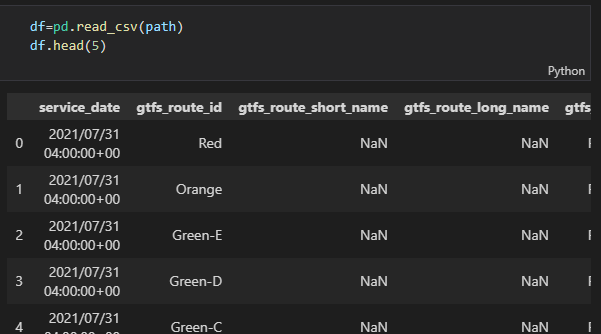
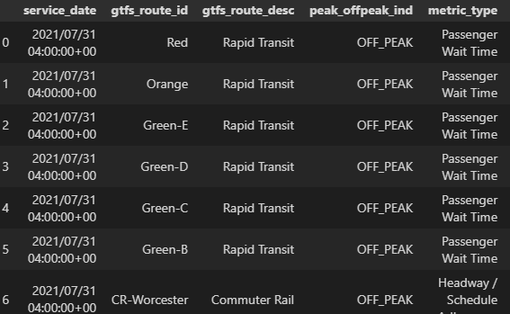
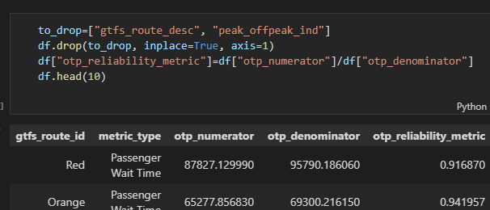
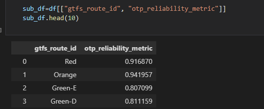
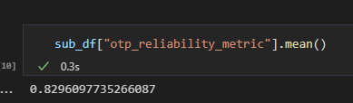
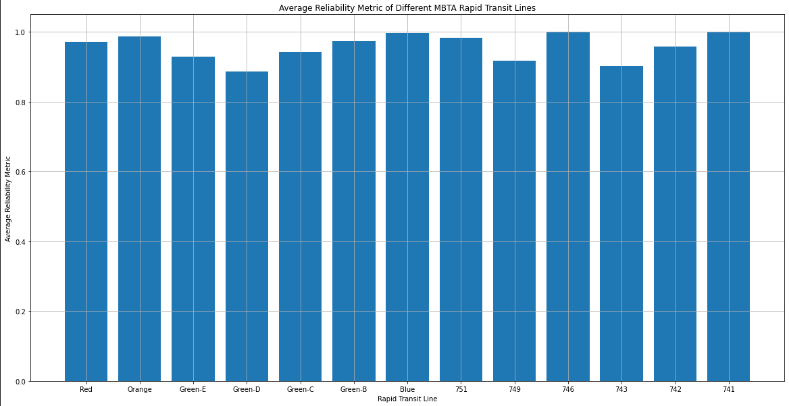

# Data Science Fundamentals Final Project
## Introduction
The objective of this project was to actively measure and compare the reliability of the Rapid Transit system from the MBTA infrastructure to its tracked [dashboard](https://www.mbtabackontrack.com/performance/index.html#/home) [4] values presented to users with not much explanation. 

I was inspired to look into this type of project, having to do with the MBTA, partially due to my own experience with it and wanting to know how much of it was reflective on the experience of the system as a whole and partially due to this [visualization deep dive](http://mbtaviz.github.io/) [1] of the MBTA's open source data that I found via GitHub.

The goal of this project was to also fit a Linear Regression model to the non-aggregated data to try and predict reliability metrics for the future and deploy the visualization and model to my personal website but that has yet to be completed so currently it is just focussed data vizualization of open source data from the MBTA on reliability of their Rapid Transit system.

## Selection of Data
As stated above, I utilized open source data from the MBTA via their [Open Data Portal](https://mbta-massdot.opendata.arcgis.com/) [2], specifically their dataset they use to track reliably meeting wait times and scheduled arrivals since 2015 from all of their services offered. The specified dataset can be found [here](https://mbta-massdot.opendata.arcgis.com/datasets/MassDOT::mbta-bus-commuter-rail-rapid-transit-reliability/about) [3].

This preview here already shows a lot of information to trim and organize by and we can see a more clear view of the data from this preview here:

Here we can see the type of route (in which we care about Rapid Transit), a column for determining whether the data was recorded during peak or non peak hours, and the metric type for measurement. For the sake of this investigation we squeezed this down more after taking out all rows that were not classified as Rapid Transit with also removing any peak hour collection to create a more fair and average metric to measure by.

As seen above, we then removed those two columns entirely as they were all the same value at that point and were left with our numerator and denominator for calculating our metric. "otp_numerator" referring to the amount of trips that met wait time or scheduling expectations and "otp_denominator" referring to the amount of trips made total and thus dividing these numbers would give us a percentage of how reliable that line met its expectations for being on time for its services.

We then finally grouped all values for each Rapid Transit line by their average reliability metric to visualize in our graph and also took the average of all the reliability metrics overall to compare to the MBTA's Performance Dashboard.

## Methods
Tools:
- Numpy, Pandas, and Matplotlib for data analysis and visualization
- GitHub and GitHub Desktop for Version Control
- Visual Studio Code for IDE Development

Planned Tools That Were Not Used:
- SciPy and Scikit-learn for Machine Learning implementation
- Heroku for Existing Web Host

## Results
We can see the visualization of the data analysis here:

This graph is organized by each different Rapid Transit line and their average Reliability Metric and along with that we also have the average value shown above before of all the reliability metric values calculated.

## Discussion
The answer we can gather by taking a more split look at each line's individual reliability can be more reliable than the total averaged value of all Rapid Transit lines that the MBTA represents on its Performance Dashboard by providing a more meaningful result to each individual and their respective Rapid Transit line that they might regularly take for commuting.

When also comparing this data and its total average Reliability Metric for all Rapid Transit to the value presented by the MBTA Performance Dashboard we can actually see very similar values (the Performance Dashboard reporting an 82% while we reported a ~83%) which is reaffirming of our process due to us excluding peak hours while the Dashboard is all hours while still resulting in similar averages overall.

Further research that was missed for this assignment due to lack of planning and diligence would be to actually fit a machine learning model to the data presented to predict the rate of change of said Reliability Metric without any outside factors for the next several years. 

## Summary
The project visualizes reliability data on MBTA Rapid Transit and their expectation of timely service and was intended to fit a machine learning model to predict said reliability for years to come and have said model hosted on a personal website but has yet to be completed.

When completed, the model and visualization will be hosted at http://www.angel-lavoie.net/ for anyone interested in follow up.

## References
[1] [Visualizing MBTA Data by Mike Barry and Brian Card](http://mbtaviz.github.io/)

[2] [MBTA Open Data Portal](https://mbta-massdot.opendata.arcgis.com/)

[3] [Dataset from MBTA Open Data Portal](https://mbta-massdot.opendata.arcgis.com/datasets/MassDOT::mbta-bus-commuter-rail-rapid-transit-reliability/about)

[4] [MBTA Performance Dashboard](https://www.mbtabackontrack.com/performance/index.html#/home)